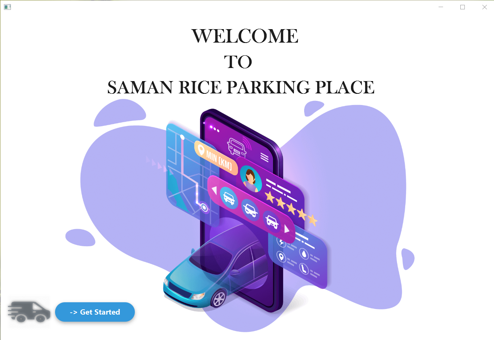

# *About* ❓
**This is my Object Oriented Programming Project**.

<h3 align="center"></h3>

# *Introduction* 📝
“Saman Rice” is a company that distributes rice all around Sri Lanka. For distribution, they use a range of 
vehicles from vans to lorries with 10 feet long trailers. These vehicles are usually parked in the basement 
of the company. There is only one entrance to the basement, where vehicles and the parking space inside 
the basement are quite limited.
 
The security guard in the basement usually manages the vehicle flow and arranges vehicle parking spaces 
with great effort due to limited space inside the basement. However, with spontaneous and unorganized 
parking that happens occasionally, sometimes drivers of the transport vehicles find themselves in 
deadlocks when moving in and out of the basement. In the worst-case scenario, they might not even find 
a parking slot to park the Transport Vehicles.

To alleviate the situation, the company decided to divide the basement into sections (Parking-slots), 
assign numbers to them, and implement a system for drivers to park their vehicles orderly.

“Saman Rice” company wants to do that parking process quickly by software application. Therefore this project is the standalone application design created to demonstrate this process using OOP concepts and in-memory application development.

# Objectives
* Object-oriented concepts
* JavaFX application development
* In-memory application development

# *Role* ✒
* Admin
* Driver

# *System Requirements* 📞
1. The driver should be able to select his name and the vehicle number he is driving when bringing 
the vehicles in and out of the basement.
2. The 14th slot should only be available for the employee transportation bus.
3. When parking, slots should be assigned to vehicles in the ascending order.
4. Parking time and the leaving time of the vehicles should be automatically saved and the 
   management should be able to view them from the interface at the entrance of the basement.
5. If a slot number in between two vehicles is freed, the vehicle should be assigned to park in the 
   first available slot when the slot numbers are arranged in the ascending order. 
6. Management should be able to see the list of vehicles outside the company premises and the 
   drivers who are driving the vehicle. 

# *Details* 🔖
Below you can see the languages architectures, tools I used  the project.

## Architectures
* MVC 

## Language
* Java - JavaFX

## Tools
* IntelliJ IDEA
* Scene Builder
